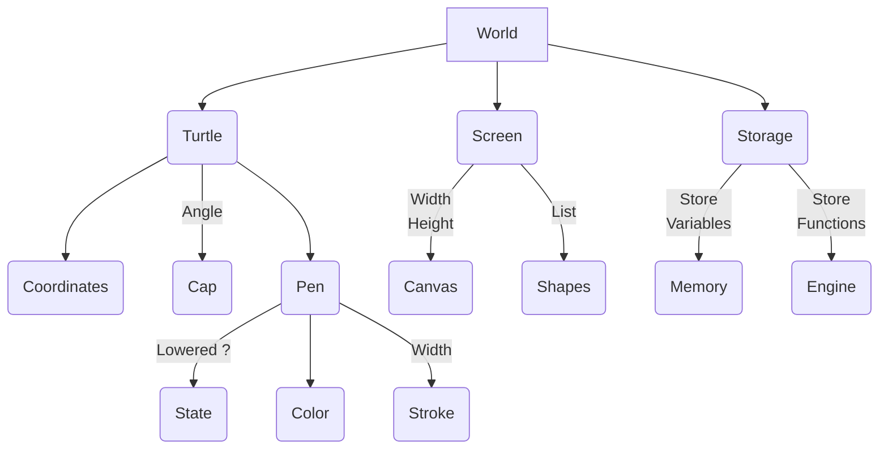
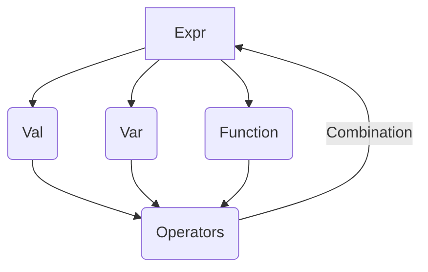

# Turtle Logo Haskell-SVG

This project consists in creating an abstract language to reproduce the **Turtle Logo** in **Haskell** by using the **SVG** format as a graphical interface.

With the features of functional programming, it will be possible to draw complex figures easily such as **fractales (Koch Snowflake,etc...)** by giving orders to the turtle.

## Project Structure

This project contains 2 folders : **"src"** and **"svg"**

 The folder **src** contains the source code :
 
1. **binSVG.hs**

This file is a module containing all functions / abstract data types related to the SVG export

2. **binTurtle.hs** 

This file is another module containing all functions related to the turtle (orders...) and the definition of the abstract language (variables,functions,expressions)

3. **randomSquares.hs**

This file is just an example about how to draw random squares on a SVG file by using the module *binSVG*

4. **turtleFigures.hs**

This file contains examples of figures (more or less complex) which can be drawn with the abstract language created.

You can find the result of these functions in the ***svg*** folder.

# The Turtle Language

The **Turtle Language** is based on a global data type called **World** where the turtle lives and which is modified by every order given to her.

This is a global schema to resume the data structure of the language.

The turtle can receive the following orders :

|Order                |Description               |Example
|---------------------|----------------------------|----------------|
|Build(Width,Height)    |Init World                |Build(1000,1000)
|TL (Angle)             |Turn Left                 |TL (Val 90)
|TR (Angle)             |Turn Right                |TR (Val 90)
|MF (Pixels)            |Move Forward              |MF (Val 100)
|MB (Pixels)            |Move Backward             |MB (Val 100)
|LP (Bool)              |Lower the pen             |LP True
|Ink (Color)            |Set Pen Color             |Ink (200,100,50)
|Stroke(Int)            |Set Pen Width             |Stroke 10
|Clear                  |Clear screen              |Clear
|Declare [Statements]   |Set Var/Functions         |Declare  [ Var "myVar := Val 10, Var "myFunc" :-> \x -> x+1   ]
|IF Expr ([Then],[Else])| The IF condition         |IF (Var "myVar" :==: Val 30) ( [MF (Val 30),TL (Val 90)],-(*iftrue*)- [MF (Val 50)] -(*ifnot*)- )
|Repeat Expr [Order]    | The FOR loop             |Repeat (Val "myVar") [ MF (Val 50), TR(Val 90) ]

## Variables / Functions / Expressions

The language supports the notion of variables/ functions/ values described as expressions (**Expr**)
You can combine any expressions by using operators like on the following schema :

[Imgur](https://i.imgur.com/8E8WVLk.jpg)

# How to use it

Create a haskell file (.hs) and import BinTurtle **(You must have binTurtle.hs and binSVG.hs in the same folder)**

Create a function which returns a World and call "execProg" function. 

*(This function takes a list of orders as parameters)*

This is an example to draw a square :

**N.B : The "Build" order must be given first.**

    import BinTurtle
    drawSquare :: World
    drawSquare = execProg[
						 Build (1000,1000) -- Must be called first
						 Declare
						 [
							  Var "length" := Val 50
						 ]
						 Repeat (Val 4)
						 [
							  MF (Var "length")
							  TL (Val 90)
						 ]
					     ]

Then, to export as a SVG file, you have to call this function like this :

    main = do
    writeWorldToSVG drawSquare "..\\svg\\square.svg"
